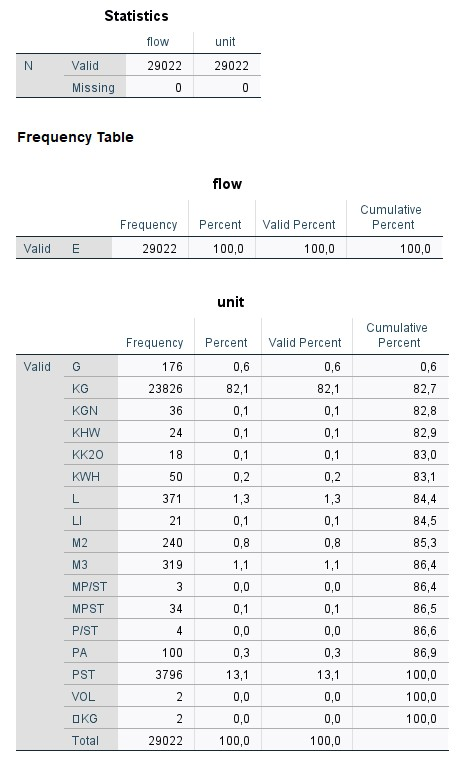
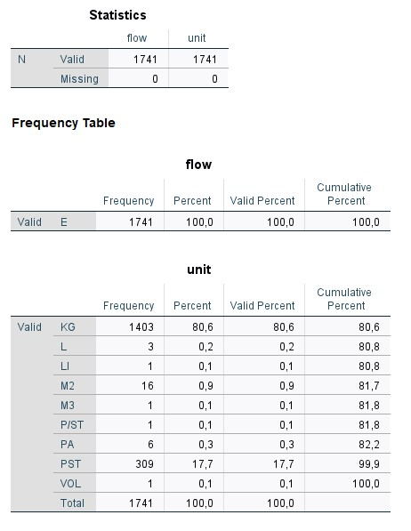
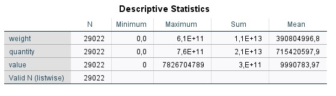
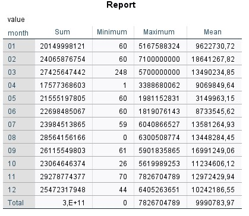
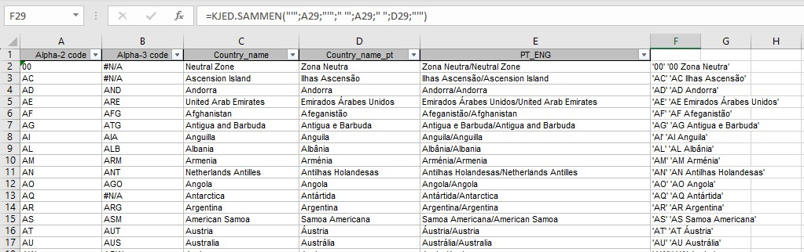

# Examples
Here are some examples for the Foreign Trade data that is to be used for the Price index for foreign trade.

It is possible to use SPSS menus for most of the tasks in SPSS. However, the syntax files that actually run the programs shall be saved. This is useful both for documentation and for the ability to re-run syntaxes.

The order of the syntaxes should also be documented. This can be done in a separate document.

Most of the menus create quite good syntax. However, there are a few tasks where the pasted syntaxes is not so good. One example of this is the check for duplicates, which create a much longer and complicated syntax than is necessary.
## Read csv files
When we work in SPSS, we always work on SPSS datasets. They shall have the file extension .sav. We can use the File, Open, Data to let SPSS guide us through the process.

The first window will look something like this:


We will not open an SPSS file, but a csv file. We change the file type to csv and then some files shall appear. We click once on the last file and it will be shown in the file name part of the window:


Now we must click on the paste button the make sure the syntax will the copied. When we do that, the next window will pop up:


We go the next step and fill in the right parameters for: 

- variable arrangement
- header line
- decimal symbol


Then we choose the parameters for:
- first line of data
- case representation
- number of cases to import
  


Now we will choose the
- delimiters (only semicolon in our data)
- text qualifier
- how to treat leading and trailing blanks


In the next step we can change the names and types of the variables to be imported. It is often easier to do this after we have pasted the syntax so we leave it as it is:


In the last step we can choose to cache the data which we usually don't need. We must remember to paste the syntax:


The pastede syntax will look like this:

```spss
PRESERVE.
 SET DECIMAL COMMA.

GET DATA  /TYPE=TXT
  /FILE="C:\Users\krl\TradeIndexMozambique\data\Export - 2021_XPMI.csv"
  /ENCODING='UTF8'
  /DELCASE=LINE
  /DELIMITERS=";"
  /ARRANGEMENT=DELIMITED
  /FIRSTCASE=2
  /DATATYPEMIN PERCENTAGE=95.0
  /VARIABLES=
  flow AUTO
  year AUTO
  month AUTO
  comno AUTO
  ref AUTO
  ItemID AUTO
  country AUTO
  unit AUTO
  weight AUTO
  quantity AUTO
  value AUTO
  valUSD AUTO
  itemno AUTO
  exporterNUIT AUTO
  exportername AUTO
  /MAP.
RESTORE.
```

We see that all columns will be imported with auto detected format. This may cause a problem later because for one data file a column (variable) may be defined as numeric and the next data file as a string. When we want to add these together SPSS will not allow us. Columns to be added together must be of the same type. Hence, we can decide the types ourselves. We can choose between numeric (F) and string (A). It can be difficult to choose the number of decimals for numeric variables, so we can just change columns the string variables. We also want to avoid the last column from our import. The enhanced syntax can look like this:

```spss
PRESERVE.
 SET DECIMAL COMMA.

GET DATA  /TYPE=TXT
  /FILE="C:\Users\krl\TradeIndexMozambique\data\Export - 2021_XPMI.csv"
  /ENCODING='UTF8'
  /DELCASE=LINE
  /DELIMITERS=";"
  /ARRANGEMENT=DELIMITED
  /FIRSTCASE=2
  /DATATYPEMIN PERCENTAGE=95.0
  /VARIABLES=
  flow A1
  year A4
  month A2
  ref A11
  ItemID A8
  comno A8
  country A2
  unit AUTO
  weight AUTO
  quantity AUTO
  value AUTO
  valUSD AUTO
  itemno AUTO
  exporterNUIT A9
  /MAP.
RESTORE.
```

## Know your data
When we have imported data to SPSS, we can begin to look at the data. There are some basic procedures we can use to get an overview of the data.

- frequencies   for categorical data with few unique values
- descriptives  for numeric data
- means         for numeric data by categories
- crosstab      for two-way frequencies

In addition to this, it is possible to make temporary selections of the data with the *temporary* and *select if* commands.

### Frequencies
We can start with a simple frequency table for two of the variables in our dataset:

``` spss
FREQUENCIES flow unit.
```

The output will be like this:


Before the actual frequency tables we get summary of missing values for each of the variables. In the frequency tables, we see that there is one row for each category and the number of cases are counted.

Now we can create the same tables for a subset of the data. After we have created the table, we want all our data to be available again. Then we can use the *temporary* and *select if* commands. The syntax:

``` spss
TEMPORARY.
SELECT IF (country = 'PT').
FREQUENCIES flow unit.
```

Now, the frequency tables will only include exports to Portugal:



### Descriptives
For numeric variables, we can get an overview by using the *descriptives* procedure. We can do like this:

``` spss
DESCRIPTIVES weight quantity value.
```

The output will be like this:


Unfortunately, there is no way to avoid scientific notation on large numbers.

We can specify which statistics to calculate:

``` spss
DESCRIPTIVES weight quantity value /statistics = sum mean min max.
```



### Means
When we want to have numeric statistics grouped, we can use the means command. The measure is mentioned before the *by* parameter and the variable to group by after:

``` spss
MEANS value BY month.
```

We get an output table like this:


We can choose the statistics ourselves:

``` spss
MEANS value BY month /CELLS=sum min max mean.
```

The output:



When have more than one measure variable, the table layout changes;

``` spss
MEANS weight value BY month /CELLS=sum min.
```

First, we get a case processing summary which gives us a brief overview of included and excluded cases. Then our statistics are pivoted 90 degrees:


## Value labels
When we want to present our results, we don't want to present codes. Instead, we have classifications which turns codes into to texts. In SPSS these ar called *value labels*

If the classification is in an Excel spreadsheet with separate columns for the code and text, we can use an Excel function to put them together in a way that is suitable for SPSS. That means the code should be in quotes (for string variables), the text should be in quotes, and we can add the code to be a part of the text. The spreadsheet looks like this:


When we have a spreadsheet with columns like these we can use this function to create a column with the classification ready for SPSS:

``` excel
=CONCATENAR("'";A2;"'";" '";A2;" ";D2;"'")  (Portuguese)
=CONCATENATE("'";A2;"'";" '";A2;" ";D2;"'") (English)
=KJED.SAMMEN("'";A2;"'";" '";A2;" ";D2;"'") (Norwegian)
```

When this is working for one cell, we can copy the formula to all cells in the new column. The new column is added:



Now we can copy the column and paste it into SPSS. Then we add the *value labels* command before the list and a dot after:

``` spss
VALUE LABELS country
'00' '00 Zona Neutra'
'AC' 'AC Ilhas Ascensão'
'AD' 'AD Andorra'
'AE' 'AE Emirados Árabes Unidos'
'AF' 'AF Afeganistão'
'AG' 'AG Antigua e Barbuda'
'AI' 'AI Anguila'
'AL' 'AL Albânia'
'AM' 'AM Arménia'
'AN' 'AN Antilhas Holandesas'
'AO' 'AO Angola'
'AQ' 'AQ Antártida'
'AR' 'AR Argentina'
'AS' 'AS Samoa Americana'
'AT' 'AT Áustria'
'AU' 'AU Austrália'
'AW' 'AW Aruba'
'AX' 'AX Alanda'
'AZ' 'AZ Azerbaijão'
'BA' 'BA Bósnia e Herzegovina'
'BB' 'BB Barbados'
'BD' 'BD Bangladesh'
'BE' 'BE Bélgica'
'BF' 'BF Burquina Fasso'
'BG' 'BG Bulgária'
'BH' 'BH Barém'
'BI' 'BI Burundi'
'BJ' 'BJ Benin'
'BL' 'BL São Bartolomeu'
'BM' 'BM Bermudas'
'BN' 'BN Brunei'
'BO' 'BO Bolívia'
'BQ' 'BQ Bonaire'
'BR' 'BR Brasil'
'BS' 'BS Bahamas'
'BT' 'BT Butão'
'BV' 'BV Ilha Bouvet'
'BW' 'BW Botsuana'
'BY' 'BY Bielorrússia'
'BZ' 'BZ Belize'
'CA' 'CA Canadá'
'CC' 'CC Ilhas Cocos (Keeling)'
'CD' 'CD RD Congo'
'CF' 'CF República Centro-Africana'
'CG' 'CG Congo'
'CH' 'CH Suíça'
'CI' 'CI Costa do Marfim'
'CK' 'CK Ilhas Cook'
'CL' 'CL Chile'
'CM' 'CM Camarões'
'CN' 'CN China'
'CO' 'CO Colômbia'
'CR' 'CR Costa Rica'
'CS' 'CS Checoslováquia'
'CU' 'CU Cuba'
'CV' 'CV Cabo Verde'
'CW' 'CW Curaçao'
'CX' 'CX Ilha do Natal'
'CY' 'CY Chipre'
'CZ' 'CZ República Checa'
'DE' 'DE Alemanha'
'DJ' 'DJ Jiboti'
'DK' 'DK Dinamarca'
'DM' 'DM Dominica'
'DO' 'DO República Dominicana'
'DZ' 'DZ Argélia'
'EC' 'EC Equador'
'EE' 'EE Estónia'
'EG' 'EG Egipto'
'EH' 'EH Saara Ocidental'
'ER' 'ER Eritreia'
'ES' 'ES Espanha'
'ET' 'ET Etiópia'
'EU' 'EU União Europeia'
'FI' 'FI Finlândia'
'FJ' 'FJ Fiji'
'FK' 'FK Ilhas Falkland'
'FM' 'FM Micronésia'
'FO' 'FO Ilhas Faroé'
'FR' 'FR França'
'FX' 'FX França Metropolitana'
'GA' 'GA Gabão'
'GB' 'GB Reino Unido'
'GD' 'GD Grenada'
'GE' 'GE Georgia'
'GF' 'GF Guiana Francesa'
'GG' 'GG Guernsey'
'GH' 'GH Gana'
'GI' 'GI Gibraltar'
'GL' 'GL Gronelândia'
'GM' 'GM Gâmbia'
'GN' 'GN Guiné'
'GP' 'GP Guadalupe'
'GQ' 'GQ Guiné Equatorial'
'GR' 'GR Grécia'
'GT' 'GT Guatemala'
'GU' 'GU Guam'
'GW' 'GW Guiné Bissau'
'GY' 'GY Guiana'
'HK' 'HK Hong Kong'
'HM' 'HM Ilhas Heard'
'HN' 'HN Honduras'
'HR' 'HR Croácia'
'HT' 'HT Haiti'
'HU' 'HU Hungria'
'ID' 'ID Indonésia'
'IE' 'IE Irlanda'
'Il' 'Il Israel'
'IM' 'IM Ilha do Homen'
'IN' 'IN Índia'
'IO' 'IO Território Britânico no Oceano'
'IQ' 'IQ Iraque'
'IR' 'IR Irão'
'IS' 'IS Islândia'
'IT' 'IT Itália'
'JE' 'JE Jersey'
'JM' 'JM Jamaica'
'JO' 'JO Jordânia'
'JP' 'JP Japão'
'KE' 'KE Quénia'
'KG' 'KG Quirguistão'
'KH' 'KH Camboja'
'KI' 'KI Quiribati'
'KM' 'KM Comores'
'KN' 'KN São Cristóvão e Nevis'
'KP' 'KP Coreia do Norte'
'KR' 'KR Coreia do Sul'
'KW' 'KW Koweit'
'KY' 'KY Ilhas Caymans'
'KZ' 'KZ Cazaquistão'
'LA' 'LA Laos'
'LB' 'LB Líbano'
'LC' 'LC Santa Lúcia'
'LI' 'LI Liechtenstein'
'LK' 'LK Sri Lanka'
'LR' 'LR Libéria'
'LS' 'LS Lesoto'
'LT' 'LT Lituânia'
'LU' 'LU Luxemburgo'
'LV' 'LV Letónia'
'LY' 'LY Líbia'
'MA' 'MA Marrocos'
'MC' 'MC Mónaco'
'MD' 'MD Moldávia'
'ME' 'ME Montenegro'
'MG' 'MG Madagáscar'
'MH' 'MH Ilhas Marshall'
'MK' 'MK Macedónia do Norte'
'ML' 'ML Mali'
'MM' 'MM Myanmar'
'MN' 'MN Mongólia'
'MO' 'MO Macau'
'MP' 'MP Marianas Setentrionais'
'MQ' 'MQ Martinica'
'MR' 'MR Mauritânia'
'MS' 'MS Monserrate'
'MT' 'MT Malta'
'MU' 'MU Maurícias'
'MV' 'MV Maldivas'
'MW' 'MW Malaui'
'MX' 'MX México'
'MY' 'MY Malásia'
'MZ' 'MZ Moçambique'
'NA' 'NA Namíbia'
'NC' 'NC Novo Caledónia'
'NE' 'NE Níger'
'NF' 'NF Ilha Norfolk'
'NG' 'NG Nigéria'
'NI' 'NI Nicarágua'
'NL' 'NL Países Baixos'
'NO' 'NO Noruega'
'NP' 'NP Nepal'
'NR' 'NR Nauru'
'NU' 'NU Niue'
'NZ' 'NZ Nova Zelândia'
'OM' 'OM Omã'
'PA' 'PA Panamá'
'PE' 'PE Peru'
'PF' 'PF Polinésia Francesa'
'PG' 'PG Papua Nova Guiné'
'PH' 'PH Filipinas'
'PK' 'PK Paquistão'
'PL' 'PL Polónia'
'PM' 'PM São Pedro e Miquelão'
'PN' 'PN Pitcairn'
'PR' 'PR Porto Rico'
'PT' 'PT Portugal'
'PW' 'PW Palau'
'PY' 'PY Paraguai'
'QA' 'QA Qatar'
'RE' 'RE Reunião'
'RO' 'RO Roménia'
'RS' 'RS Sérvia'
'RU' 'RU Rússia'
'RW' 'RW Ruanda'
'SA' 'SA Arábia Saudita'
'SB' 'SB Ilhas Salomão'
'SC' 'SC Seicheles'
'SD' 'SD Sudão'
'SE' 'SE Suécia'
'SG' 'SG Singapura'
'SH' 'SH Santa Helena'
'SI' 'SI Eslovénia'
'SJ' 'SJ Ilhas Svalbard  e Mayen'
'SK' 'SK República Eslovaca'
'SL' 'SL Serra Leoa'
'SM' 'SM San Marino'
'SN' 'SN Senegal'
'SO' 'SO Somália'
'SR' 'SR Suriname'
'SS' 'SS Sudão do Sul'
'ST' 'ST São Tomé e Príncipe'
'SU' 'SU ex-URSS'
'SV' 'SV El Salvador'
'SX' 'SX São Martinho'
'SY' 'SY Síria'
'SZ' 'SZ Essuatíni'
'TC' 'TC Ilhas Turks e Caicos'
'TD' 'TD Chade'
'TF' 'TF Terras Austrais Francesas'
'TG' 'TG Togo'
'TH' 'TH Tailândia'
'TJ' 'TJ Tajiquistão'
'TK' 'TK Toquelau'
'TL' 'TL Timor-Leste'
'TM' 'TM Turquemenistão'
'TN' 'TN Tunísia'
'TO' 'TO Tonga'
'TP' 'TP Timor-Leste'
'TR' 'TR Turquia'
'TT' 'TT Trindade e Tobago'
'TV' 'TV Tuvalu'
'TW' 'TW Taiwan'
'TZ' 'TZ Tanzânia'
'UA' 'UA Ucrânia'
'UG' 'UG Uganda'
'UM' 'UM EUA Territórios Insulares'
'US' 'US Estados Unidos'
'UY' 'UY Uruguai'
'UZ' 'UZ Uzbequistão'
'VA' 'VA Estado de Vaticano'
'VC' 'VC São Vicente e Granadinas'
'VE' 'VE Venezuela'
'VG' 'VG Ilhas Virgens Britânicas'
'VI' 'VI Ilhas Virgens Americanas'
'VN' 'VN Vietname'
'VU' 'VU Vanuatu'
'WF' 'WF Ilhas Wallis e Futuna'
'WS' 'WS Samoa'
'XK' 'XK Kosovo'
'XX' 'XX Organizações Internacionais'
'YE' 'YE Iémen'
'YT' 'YT Maiote'
'YU' 'YU Jugoslávia'
'ZA' 'ZA África  do Sul'
'ZM' 'ZM Zâmbia'
'ZW' 'ZW Zimbabué'
'ZZ' 'ZZ Outros Países'
.
```

