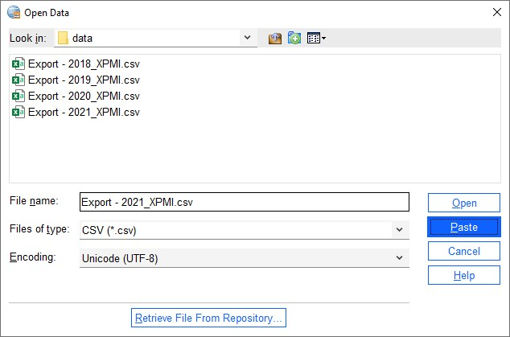
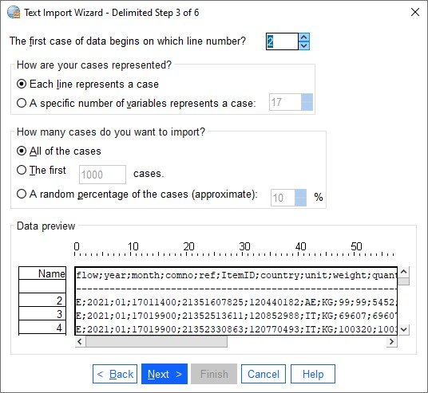
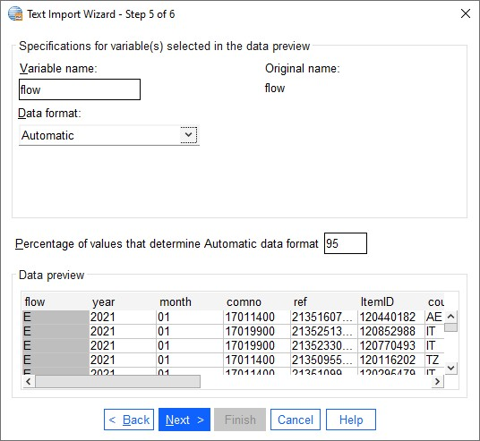
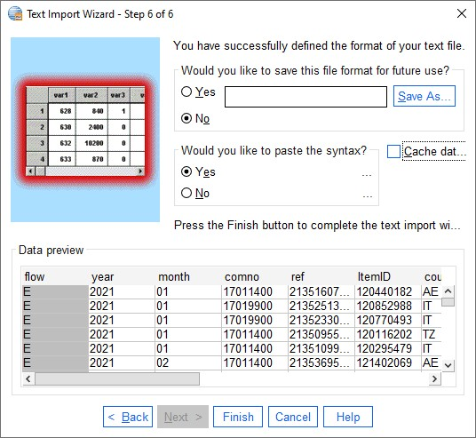
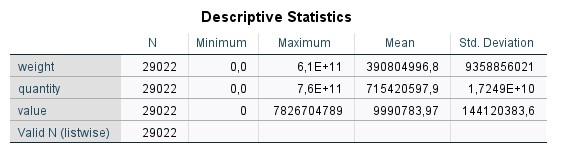
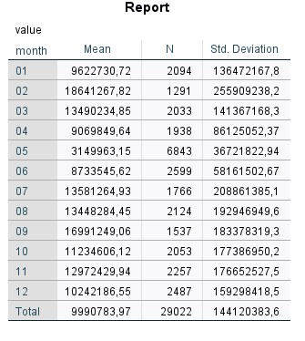
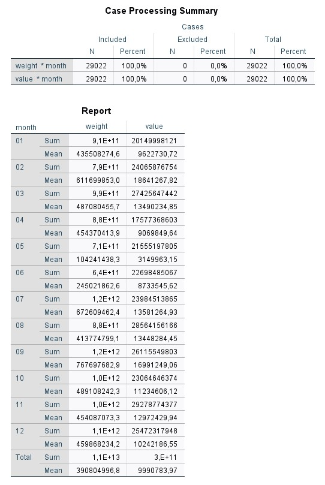
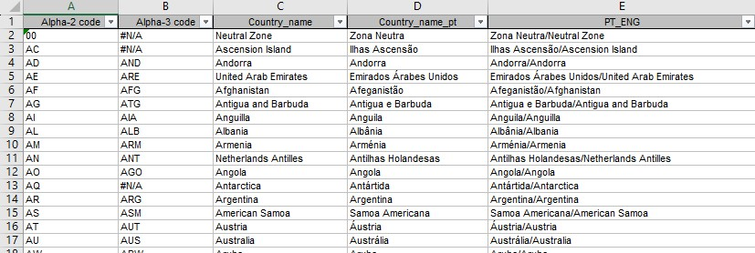
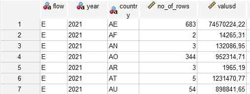
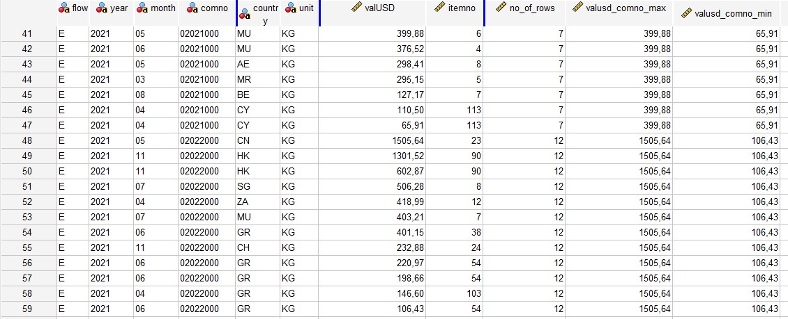

# SPSS Examples
Here are some examples for the Foreign Trade data that is to be used for the Price index for foreign trade.

It is possible to use SPSS menus for most of the tasks in SPSS. However, the syntax files that actually run the programs shall be saved. This is useful both for documentation and for the ability to re-run syntaxes.

The order of the syntaxes should also be documented. This can be done in a separate document.

Most of the menus create quite good syntax. However, there are a few tasks where the pasted syntaxes is not so good. One example of this is the check for duplicates, which create a much longer and complicated syntax than is necessary.
## Read csv files
When we work in SPSS, we always work on SPSS datasets. They shall have the file extension .sav. We can use the File, Open, Data to let SPSS guide us through the process.

The first window will look something like this:


We will not open an SPSS file, but a csv file. We change the file type to csv and then some files shall appear. We click once on the last file and it will be shown in the file name part of the window:



Now we must click on the paste button the make sure the syntax will the copied. When we do that, the next window will pop up:


We go the next step and fill in the right parameters for: 

- variable arrangement
- header line
- decimal symbol


Then we choose the parameters for:
- first line of data
- case representation
- number of cases to import
  


Now we will choose the
- delimiters (only semicolon in our data)
- text qualifier
- how to treat leading and trailing blanks


In the next step we can change the names and types of the variables to be imported. It is often easier to do this after we have pasted the syntax so we leave it as it is:



In the last step we can choose to cache the data which we usually don't need. We must remember to paste the syntax:



The pastede syntax will look like this:

```spss
PRESERVE.
 SET DECIMAL COMMA.

GET DATA  /TYPE=TXT
  /FILE="C:\Users\krl\TradeIndexMozambique\data\Export - 2021_XPMI.csv"
  /DELCASE=LINE
  /DELIMITERS=";"
  /ARRANGEMENT=DELIMITED
  /FIRSTCASE=2
  /DATATYPEMIN PERCENTAGE=95.0
  /VARIABLES=
  flow AUTO
  year AUTO
  month AUTO
  comno AUTO
  ref AUTO
  ItemID AUTO
  country AUTO
  unit AUTO
  weight AUTO
  quantity AUTO
  value AUTO
  valUSD AUTO
  itemno AUTO
  exporterNUIT AUTO
  exportername AUTO
  /MAP.
RESTORE.
```

We see that all columns will be imported with auto detected format. This may cause a problem later because for one data file a column (variable) may be defined as numeric and the next data file as a string. When we want to add these together SPSS will not allow us. Columns to be added together must be of the same type. Hence, we can decide the types ourselves. We can choose between numeric (F) and string (A). It can be difficult to choose the number of decimals for numeric variables, so we can just change columns the string variables. We also want to avoid the last column from our import. The enhanced syntax can look like this:

```spss
PRESERVE.
 SET DECIMAL COMMA.

GET DATA  /TYPE=TXT
  /FILE="C:\Users\krl\TradeIndexMozambique\data\Export - 2021_XPMI.csv"
  /DELCASE=LINE
  /DELIMITERS=";"
  /ARRANGEMENT=DELIMITED
  /FIRSTCASE=2
  /DATATYPEMIN PERCENTAGE=95.0
  /VARIABLES=
  flow A1
  year A4
  month A2
  comno A8
  ref A11
  ItemID A8
  country A2
  unit AUTO
  weight AUTO
  quantity AUTO
  value AUTO
  valUSD AUTO
  itemno AUTO
  exporterNUIT A9
  /MAP.
RESTORE.
```


## Know your data
When we have imported data to SPSS, we can begin to look at the data. There are some basic procedures we can use to get an overview of the data.

- frequencies   for categorical data with few unique values
- descriptives  for numeric data
- means         for numeric data by categories
- crosstab      for two-way frequencies

In addition to this, it is possible to make temporary selections of the data with the `temporary` and `select if` commands.

### Frequencies
We can start with a simple frequency table for two of the variables in our dataset:

``` spss
FREQUENCIES flow unit.
```

The output will be like this:


Before the actual frequency tables we get summary of missing values for each of the variables. In the frequency tables, we see that there is one row for each category and the number of cases are counted.

Now we can create the same tables for a subset of the data. After we have created the table, we want all our data to be available again. Then we can use the `temporary` and `select if` commands. The syntax:

``` spss
TEMPORARY.
SELECT IF (country = 'PT').
FREQUENCIES flow unit.
```

Now, the frequency tables will only include exports to Portugal:


### Descriptives
For numeric variables, we can get an overview by using the *descriptives* procedure. We can do like this:

``` spss
DESCRIPTIVES weight quantity value.
```

The output will be like this:



Unfortunately, there is no way to avoid scientific notation on large numbers.

We can specify which statistics to calculate:

``` spss
DESCRIPTIVES weight quantity value /statistics = sum mean min max.
```


### Means
When we want to have numeric statistics grouped, we can use the means command. The measure is mentioned before the `by` parameter and the variable to group by after:

``` spss
MEANS value BY month.
```

We get an output table like this:



We can choose the statistics ourselves:

``` spss
MEANS value BY month /CELLS=sum min max mean.
```

The output:


When have more than one measure variable, the table layout changes;

``` spss
MEANS weight value BY month /CELLS=sum min.
```

First, we get a case processing summary which gives us a brief overview of included and excluded cases. Then our statistics are pivoted 90 degrees:




## Value labels
When we want to present our results, we don't want to present codes. Instead, we have classifications which turns codes into to texts. In SPSS these ar called *value labels*

If the classification is in an Excel spreadsheet with separate columns for the code and text, we can use an Excel function to put them together in a way that is suitable for SPSS. That means the code should be in quotes (for string variables), the text should be in quotes, and we can add the code to be a part of the text. The spreadsheet looks like this:



When we have a spreadsheet with columns like these we can use this function to create a column with the classification ready for SPSS:

``` excel
=CONCATENAR("'";A2;"'";" '";A2;" ";D2;"'")  (Portuguese)
=CONCATENATE("'";A2;"'";" '";A2;" ";D2;"'") (English)
=KJED.SAMMEN("'";A2;"'";" '";A2;" ";D2;"'") (Norwegian)
```

When this is working for one cell, we can copy the formula to all cells in the new column. The new column is added:


Now we can copy the column and paste it into SPSS. Then we add the *value labels* command before the list and a dot after:

``` spss
VALUE LABELS country
'00' '00 Zona Neutra'
'AC' 'AC Ilhas Ascensão'
'AD' 'AD Andorra'
'AE' 'AE Emirados Árabes Unidos'
'AF' 'AF Afeganistão'
'AG' 'AG Antigua e Barbuda'
'AI' 'AI Anguila'
'AL' 'AL Albânia'
'AM' 'AM Arménia'
'AN' 'AN Antilhas Holandesas'
'AO' 'AO Angola'
'AQ' 'AQ Antártida'
'AR' 'AR Argentina'
'AS' 'AS Samoa Americana'
'AT' 'AT Áustria'
'AU' 'AU Austrália'
'AW' 'AW Aruba'
'AX' 'AX Alanda'
'AZ' 'AZ Azerbaijão'
'BA' 'BA Bósnia e Herzegovina'
'BB' 'BB Barbados'
'BD' 'BD Bangladesh'
'BE' 'BE Bélgica'
'BF' 'BF Burquina Fasso'
'BG' 'BG Bulgária'
'BH' 'BH Barém'
'BI' 'BI Burundi'
'BJ' 'BJ Benin'
'BL' 'BL São Bartolomeu'
'BM' 'BM Bermudas'
'BN' 'BN Brunei'
'BO' 'BO Bolívia'
'BQ' 'BQ Bonaire'
'BR' 'BR Brasil'
'BS' 'BS Bahamas'
'BT' 'BT Butão'
'BV' 'BV Ilha Bouvet'
'BW' 'BW Botsuana'
'BY' 'BY Bielorrússia'
'BZ' 'BZ Belize'
'CA' 'CA Canadá'
'CC' 'CC Ilhas Cocos (Keeling)'
'CD' 'CD RD Congo'
'CF' 'CF República Centro-Africana'
'CG' 'CG Congo'
'CH' 'CH Suíça'
'CI' 'CI Costa do Marfim'
'CK' 'CK Ilhas Cook'
'CL' 'CL Chile'
'CM' 'CM Camarões'
'CN' 'CN China'
'CO' 'CO Colômbia'
'CR' 'CR Costa Rica'
'CS' 'CS Checoslováquia'
'CU' 'CU Cuba'
'CV' 'CV Cabo Verde'
'CW' 'CW Curaçao'
'CX' 'CX Ilha do Natal'
'CY' 'CY Chipre'
'CZ' 'CZ República Checa'
'DE' 'DE Alemanha'
'DJ' 'DJ Jiboti'
'DK' 'DK Dinamarca'
'DM' 'DM Dominica'
'DO' 'DO República Dominicana'
'DZ' 'DZ Argélia'
'EC' 'EC Equador'
'EE' 'EE Estónia'
'EG' 'EG Egipto'
'EH' 'EH Saara Ocidental'
'ER' 'ER Eritreia'
'ES' 'ES Espanha'
'ET' 'ET Etiópia'
'EU' 'EU União Europeia'
'FI' 'FI Finlândia'
'FJ' 'FJ Fiji'
'FK' 'FK Ilhas Falkland'
'FM' 'FM Micronésia'
'FO' 'FO Ilhas Faroé'
'FR' 'FR França'
'FX' 'FX França Metropolitana'
'GA' 'GA Gabão'
'GB' 'GB Reino Unido'
'GD' 'GD Grenada'
'GE' 'GE Georgia'
'GF' 'GF Guiana Francesa'
'GG' 'GG Guernsey'
'GH' 'GH Gana'
'GI' 'GI Gibraltar'
'GL' 'GL Gronelândia'
'GM' 'GM Gâmbia'
'GN' 'GN Guiné'
'GP' 'GP Guadalupe'
'GQ' 'GQ Guiné Equatorial'
'GR' 'GR Grécia'
'GT' 'GT Guatemala'
'GU' 'GU Guam'
'GW' 'GW Guiné Bissau'
'GY' 'GY Guiana'
'HK' 'HK Hong Kong'
'HM' 'HM Ilhas Heard'
'HN' 'HN Honduras'
'HR' 'HR Croácia'
'HT' 'HT Haiti'
'HU' 'HU Hungria'
'ID' 'ID Indonésia'
'IE' 'IE Irlanda'
'IL' 'IL Israel'
'IM' 'IM Ilha do Homen'
'IN' 'IN Índia'
'IO' 'IO Território Britânico no Oceano'
'IQ' 'IQ Iraque'
'IR' 'IR Irão'
'IS' 'IS Islândia'
'IT' 'IT Itália'
'JE' 'JE Jersey'
'JM' 'JM Jamaica'
'JO' 'JO Jordânia'
'JP' 'JP Japão'
'KE' 'KE Quénia'
'KG' 'KG Quirguistão'
'KH' 'KH Camboja'
'KI' 'KI Quiribati'
'KM' 'KM Comores'
'KN' 'KN São Cristóvão e Nevis'
'KP' 'KP Coreia do Norte'
'KR' 'KR Coreia do Sul'
'KW' 'KW Koweit'
'KY' 'KY Ilhas Caymans'
'KZ' 'KZ Cazaquistão'
'LA' 'LA Laos'
'LB' 'LB Líbano'
'LC' 'LC Santa Lúcia'
'LI' 'LI Liechtenstein'
'LK' 'LK Sri Lanka'
'LR' 'LR Libéria'
'LS' 'LS Lesoto'
'LT' 'LT Lituânia'
'LU' 'LU Luxemburgo'
'LV' 'LV Letónia'
'LY' 'LY Líbia'
'MA' 'MA Marrocos'
'MC' 'MC Mónaco'
'MD' 'MD Moldávia'
'ME' 'ME Montenegro'
'MG' 'MG Madagáscar'
'MH' 'MH Ilhas Marshall'
'MK' 'MK Macedónia do Norte'
'ML' 'ML Mali'
'MM' 'MM Myanmar'
'MN' 'MN Mongólia'
'MO' 'MO Macau'
'MP' 'MP Marianas Setentrionais'
'MQ' 'MQ Martinica'
'MR' 'MR Mauritânia'
'MS' 'MS Monserrate'
'MT' 'MT Malta'
'MU' 'MU Maurícias'
'MV' 'MV Maldivas'
'MW' 'MW Malaui'
'MX' 'MX México'
'MY' 'MY Malásia'
'MZ' 'MZ Moçambique'
'NA' 'NA Namíbia'
'NC' 'NC Novo Caledónia'
'NE' 'NE Níger'
'NF' 'NF Ilha Norfolk'
'NG' 'NG Nigéria'
'NI' 'NI Nicarágua'
'NL' 'NL Países Baixos'
'NO' 'NO Noruega'
'NP' 'NP Nepal'
'NR' 'NR Nauru'
'NU' 'NU Niue'
'NZ' 'NZ Nova Zelândia'
'OM' 'OM Omã'
'PA' 'PA Panamá'
'PE' 'PE Peru'
'PF' 'PF Polinésia Francesa'
'PG' 'PG Papua Nova Guiné'
'PH' 'PH Filipinas'
'PK' 'PK Paquistão'
'PL' 'PL Polónia'
'PM' 'PM São Pedro e Miquelão'
'PN' 'PN Pitcairn'
'PR' 'PR Porto Rico'
'PT' 'PT Portugal'
'PW' 'PW Palau'
'PY' 'PY Paraguai'
'QA' 'QA Qatar'
'RE' 'RE Reunião'
'RO' 'RO Roménia'
'RS' 'RS Sérvia'
'RU' 'RU Rússia'
'RW' 'RW Ruanda'
'SA' 'SA Arábia Saudita'
'SB' 'SB Ilhas Salomão'
'SC' 'SC Seicheles'
'SD' 'SD Sudão'
'SE' 'SE Suécia'
'SG' 'SG Singapura'
'SH' 'SH Santa Helena'
'SI' 'SI Eslovénia'
'SJ' 'SJ Ilhas Svalbard  e Mayen'
'SK' 'SK República Eslovaca'
'SL' 'SL Serra Leoa'
'SM' 'SM San Marino'
'SN' 'SN Senegal'
'SO' 'SO Somália'
'SR' 'SR Suriname'
'SS' 'SS Sudão do Sul'
'ST' 'ST São Tomé e Príncipe'
'SU' 'SU ex-URSS'
'SV' 'SV El Salvador'
'SX' 'SX São Martinho'
'SY' 'SY Síria'
'SZ' 'SZ Essuatíni'
'TC' 'TC Ilhas Turks e Caicos'
'TD' 'TD Chade'
'TF' 'TF Terras Austrais Francesas'
'TG' 'TG Togo'
'TH' 'TH Tailândia'
'TJ' 'TJ Tajiquistão'
'TK' 'TK Toquelau'
'TL' 'TL Timor-Leste'
'TM' 'TM Turquemenistão'
'TN' 'TN Tunísia'
'TO' 'TO Tonga'
'TP' 'TP Timor-Leste'
'TR' 'TR Turquia'
'TT' 'TT Trindade e Tobago'
'TV' 'TV Tuvalu'
'TW' 'TW Taiwan'
'TZ' 'TZ Tanzânia'
'UA' 'UA Ucrânia'
'UG' 'UG Uganda'
'UM' 'UM EUA Territórios Insulares'
'US' 'US Estados Unidos'
'UY' 'UY Uruguai'
'UZ' 'UZ Uzbequistão'
'VA' 'VA Estado de Vaticano'
'VC' 'VC São Vicente e Granadinas'
'VE' 'VE Venezuela'
'VG' 'VG Ilhas Virgens Britânicas'
'VI' 'VI Ilhas Virgens Americanas'
'VN' 'VN Vietname'
'VU' 'VU Vanuatu'
'WF' 'WF Ilhas Wallis e Futuna'
'WS' 'WS Samoa'
'XK' 'XK Kosovo'
'XX' 'XX Organizações Internacionais'
'YE' 'YE Iémen'
'YT' 'YT Maiote'
'YU' 'YU Jugoslávia'
'ZA' 'ZA África  do Sul'
'ZM' 'ZM Zâmbia'
'ZW' 'ZW Zimbabué'
'ZZ' 'ZZ Outros Países'
.
```

Now we can make a frequency table to see if there are any countries which have not added text:

``` spss
FREQUENCIES country.
```

## New variables
There are two different kind of variables we can use in SPSS:

- String (character)
- Numeric (includes date and time variables)

String variables has to be defined before we assign them values. This is done with the `string` command. Numeric variables can assign a value when it is created. For both string and numeric variables, we assign values with the `compute` command. Here, we create a numeric variable for price and a string variable for HS2. For SPSS to actually do these calculations, we can add the `execute` command:

``` spss
COMPUTE pricekg = value / weight.

STRING hs2 (a2).
COMPUTE hs2 = CHAR.SUBSTR(comno,1,2).

EXECUTE.
```

We see in the syntax above that we use `char.substr`. This is a function that extracts parts of a string variable. The `char.substr` takes three parameters:
- the name of the variable to extract from
- the first position to extract
- the number of characters to extract

There are many useful functions in SPSS in addition to `char.substr`.

## Format variables
SPSS determines have to display variables. For numeric variables, the display format chosen by SPSS may not be as we like it to be. We can then change it by using the `formats` command. This command does not change any data, just the way it is displayed. Here we format the price per kg with 2 decimals:

``` spss
FORMATS pricekg (f14.2).
```

14 digit is the total number of characters to display, of which 2 is decimals and 1 is the decimal sign.

## Sort datasets
We can sort our datasets either by ascending og descending values. The command we use is `sort cases`. The default is to sort by ascending values. To sort descening instead, we include `(D)` after the variables name in the `sort cases` command. However, all variables will now be sorted descending unless we add an (A) to the variable before the variable with `(D)`. We will now sort the data by the background variables:

``` spss
SORT CASES BY flow year month comno country.
```

To sort the last variable descending and the other ones ascending we can do like this:

``` spss
SORT CASES BY flow year comno (A) valusd (D).
```

## Save datasets
To save a dataset, we use the `save` command:

``` spss
SAVE OUTFILE='C:\Users\krl\TradeIndexMozambique\data\export_2021.sav'.
``` 

We see above and the other places where datasets are mentioned that the whole path to the file is included. This is not ideal because there will be several places to change if we cahnge the location of the data files. Instead we should extract the main path from the string and put it in a `cd` command. The `cd` (change directory) is changing the working directory for the SPSS files. This command should be put in a separate syntax file, which we should always run as our first syntax every time we open SPSS.

``` spss
CD 'c:\users\krl\TradeIndexMozambique'.
```

## Open an SPSS dataset
When we have saved an SPSS dataset it can later be opened again. We use the `get` command for this. But first, we should be certain that we don't have more than one dataset open at the same time, as this can cause problems and confusion. This is done with the command `dataset close all`. An example:

``` spss
DATASET CLOSE ALL.
GET FILE='data\export_2021.sav'.
```

## Aggregation
There are two ways we do aggregation:
- Create a new dataset on an aggregated level of the data
- Add aggregated data to every row of the dataset

We can do both with the `aggregate` command. First, we will see how we can agregate to a new file. We knpw now that our data has one row for each combination of *flow*, *year*, *month*, *comno* and *country*. When we aggregate we first choose the aggregation level. For instance, we can aggregate to the level of *flow*, *year* and *country*. These will be our break variables. Now that we have decide the aggregation level, we need to decide what variables we want to aggregate and what kind of aggregation to do. The aggreagtion variables will usually be one or more of our measure variables. We can choose between different statistics for how to aggregate, like sum, mean, max, min etc. Here is an example where we calculate the sum of the *valusd* variable by *flow*, *year* and *country*:

``` spss
AGGREGATE 
    /OUTFILE=* 
    /BREAK flow year country
    /no_of_rows = N()
    /valusd = SUM(valusd)
    .
```
The aggregated dataset:



Now we will look at the second way to aggregate, where we add aggregated variables to the exixting dataset. First, we have to reopen the original dataset. Then we can add the new variables with the `aggregate` command. The clue here is to use the `mode = addvariables` parameter. The aggregated variables will get the same value for each row in the group of the break level, here *flow*, *year* and *comno*:

``` spss
DATASET CLOSE ALL.
GET FILE='data\export_2021.sav'.

AGGREGATE 
    /OUTFILE=* MODE=ADDVARIABLES
    /BREAK flow year comno
    /no_of_rows = N()
    /valusd_comno_max = MAX(valusd)
    /valusd_comno_min = MIN(valusd)
    .

SORT CASES BY flow year comno (A) valusd (D).
```

Now we have added some aggregated variables. They all have the same values within the aggregation level used:



## Duplicates
We can use the ```match files``` command to check for duplicates. The way to do that is to mark each row in the dataset as first or not first within the group of variables we will check for duplicates within. Usually we check for duplicates on the variables that is to identify a row. In our dataset it is the variables *flow*, *year*, *month*, *comno*, *ref*, *ItemID* and *country*. After we have added the mark for first or not within the group, we can make a frequency table to get an owerview of the amount of duplicates. Here is an example on a duplicate check with a frequency check table:

``` spss
DATASET CLOSE ALL.
GET FILE='C:\Users\krl\TradeIndexMozambique\data\export_2021.sav'.
SORT CASES BY flow year month comno ref ItemID country.

MATCH FILES FILE=*
           /BY flow year month comno ref ItemID country
           /FIRST = first_id
           .

FREQUENCIES first_id.
```

If there are any rows with *first_id* = 1, we can check them a little bit more. 

We will now check for duplicates on the level of *flow*, *year*, *month*, *comno* and *country*:

``` spss
DELETE VARIABLES first_id.

SORT CASES BY flow year month comno country.

MATCH FILES FILE=*
           /BY flow year month comno country
           /FIRST = first_id
           .

FREQUENCIES first_id.
```

Before we create an index we want to aggregate the data to the level where there is one row for each combination of *flow*, *year*, *month*, *comno* and *country*:

``` spss
AGGREGATE 
    /OUTFILE=* 
    /BREAK flow year month comno country
    /weight = SUM(weight)
    /quantity = sum(quantity)
    /value = SUM(value)
    /valusd = SUM(valusd)
    .
```

When we now do a duplicate check there are no duplicates:

``` spss
MATCH FILES FILE=*
           /BY flow year month comno country
           /FIRST = first_id
           .

FREQUENCIES first_id.
```
## Read Excel files
We read an Excel file more or less the same way as a delimited text-file, with the *get data* command. This time we use type parameter xlsx. When we use the file, open wizard we paste a syntax like this:

``` spss
DATASET CLOSE ALL.
GET DATA
  /TYPE=XLSX
  /FILE='data\Commodities_Catalogue_XPMI.xlsx'
  /SHEET=name 'Pauta Grupos_2023_'
  /CELLRANGE=FULL
  /READNAMES=ON
.
EXECUTE.
```

We can delete variables we don't need and also check for duplicates:

``` spss
DELETE VARIABLES DescriçãoSH8 TO Descriptionsitcr4_3 Descriptionsitcr4_2 Descriptionsitcr4_1 TO becno.
EXECUTE.

SORT CASES BY comno.
MATCH FILES FILE=*
           /BY comno
           /FIRST = first_id
           .

FREQUENCIES first_id.

DELETE VARIABLES first_id.
```
Finally, we can save our dataset:

``` spss
SAVE OUTFILE='data\commodity_sitc.sav'.
```

## Matching files
We use the *match files* command to macth files. It has two different ways to match files. Either we can choose that both files should provide with cases, or we can choose to use one of the files as a keyed table. A keyed table may not have any duplicates. Cases in the keyed table with key variables whose values do not appear in the other file are not written to the output file. If there are more than one case with the same key value and that value is in the keyed table as well, all cases will get the information from the keyed table. We define a data set as a keyed table by using the *table* subcommand. Ordinary files are named with the *file* subcommand. If there are duplicates (i.e. more than one case with the same values for the key variables) SPSS will match 1 to 1 as long as it is possible and then match 1 to 0 or 0 to 1. The files we match have to be sorted on the key variables by which they will be matched by before we use the *match files* command. 

We now want to match the data file with the data file with the list of commodities and add the sitc codes to the data file. The list of commodities will be a keyd table which we define with the *table* sub-command. 

To check whether the *comno* value is found in the catalog, we include the *in* sub-command. It will create a new variable, which value will be one when the catalog contribute to the match (it matches) and zero when it does not contribute (it does not match).

``` spss
DATASET CLOSE ALL.
GET FILE='data\export_agg_2021.sav'.
SORT CASES BY comno.

MATCH FILES FILE=*
           /TABLE='data\commodity_sitc.sav'
           /IN=found_sitc
           /BY comno
           .

FREQUENCIES found_sitc sitcr4_1.
DELETE VARIABLES found_sitc.
```


