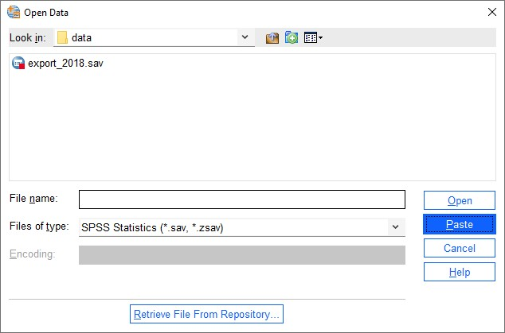
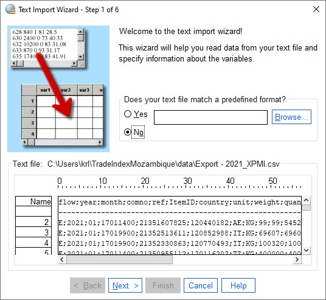
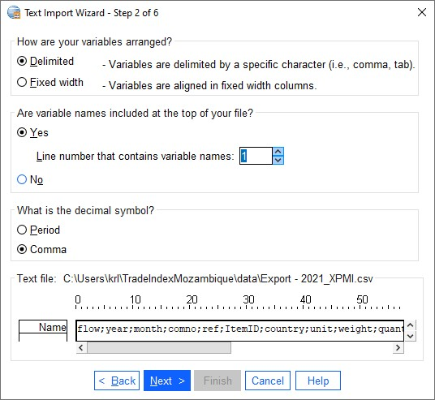
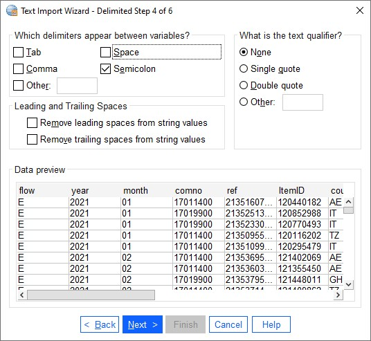

# Exercises
Here are some exercises for the Foreign Trade data that is to be used for the Price index for foreign trade.

It is possible to use SPSS menus for most of the tasks in SPSS. However, the syntax files that actually run the programs shall be saved. This is useful both for documentation and for the ability to re-run syntaxes.

The order of the syntaxes should also be documented. This can be done in a separate document.

Most of the menus create quite good syntax. However, there are a few tasks where the pasted syntaxes is not so good. One example of this is the check for duplicates, which create a much longer and complicated syntax than is necessary.
## Read csv files
When we work in SPSS, we always work on SPSS datasets. They shall have the file extension .sav. We can use the File, Open, Data to let SPSS guide us through the process.

The first window will look something like this:



We will not open an SPSS file, but a csv file. We change the file type to csv and then some files shall appear. We click once on the last file and it will be shown in the file name part of the window:


Now we must click on the paste button the make sure the syntax will the copied. When we do that, the next window will pop up:



We go the next step and fill in the right parameters for: 

- variable arrangement
- header line
- decimal symbol



Then we choose the parameters for:
- first line of data
- case representation
- number of cases to import
  


Now we will choose the
- delimiters (only semicolon in our data)
- text qualifier
- how to treat leading and trailing blanks



In the next step we can change the names and types of the variables to be imported. It is often easier to do this after we have pasted the syntax so we leave it as it is:


In the last step we can choose to cache the data which we usually don't need. We must remember to paste the syntax:


The pastede syntax will look like this:

```spss
PRESERVE.
 SET DECIMAL COMMA.

GET DATA  /TYPE=TXT
  /FILE="C:\Users\krl\TradeIndexMozambique\data\Export - 2021_XPMI.csv"
  /ENCODING='UTF8'
  /DELCASE=LINE
  /DELIMITERS=";"
  /ARRANGEMENT=DELIMITED
  /FIRSTCASE=2
  /DATATYPEMIN PERCENTAGE=95.0
  /VARIABLES=
  flow AUTO
  year AUTO
  month AUTO
  comno AUTO
  ref AUTO
  ItemID AUTO
  country AUTO
  unit AUTO
  weight AUTO
  quantity AUTO
  value AUTO
  valUSD AUTO
  itemno AUTO
  exporterNUIT AUTO
  exportername AUTO
  /MAP.
RESTORE.
```

We see that all columns will be imported with auto detected format. This may cause a problem later because for one data file a column (variable) may be defined as numeric and the next data file as a string. When we want to add these together SPSS will not allow us. Columns to be added together must be of the same type. Hence, we can decide the types ourselves. We can choose between numeric (F) and string (A). It can be difficult to choose the number of decimals for numeric variables, so we can just change columns the string variables. We also want to avoid the last column from our import. The enhanced syntax can look like this:

```spss
PRESERVE.
 SET DECIMAL COMMA.

GET DATA  /TYPE=TXT
  /FILE="C:\Users\krl\TradeIndexMozambique\data\Export - 2021_XPMI.csv"
  /ENCODING='UTF8'
  /DELCASE=LINE
  /DELIMITERS=";"
  /ARRANGEMENT=DELIMITED
  /FIRSTCASE=2
  /DATATYPEMIN PERCENTAGE=95.0
  /VARIABLES=
  flow A1
  year A4
  month A2
  ref A11
  ItemID A8
  comno A8
  country A2
  unit AUTO
  weight AUTO
  quantity AUTO
  value AUTO
  valUSD AUTO
  itemno AUTO
  exporterNUIT A9
  /MAP.
RESTORE.
```


